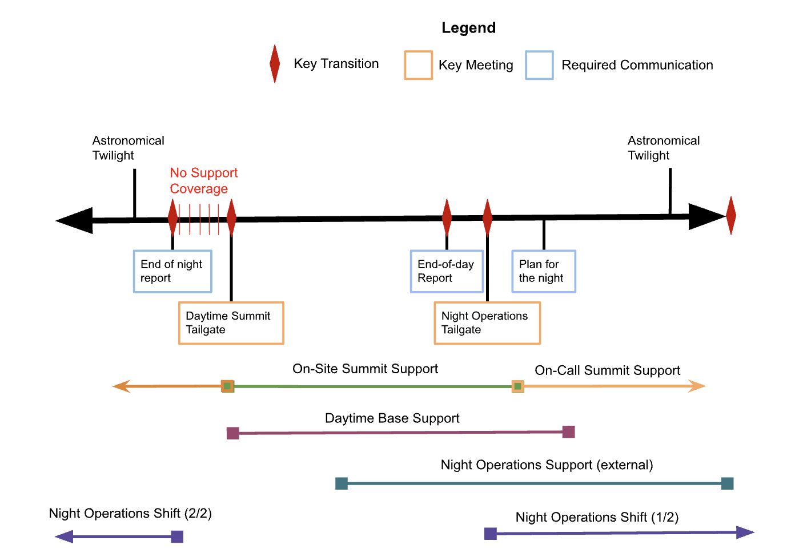
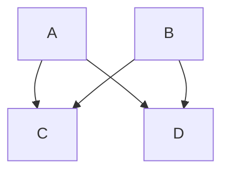

# Vera C. Rubin Concept of Operations

```{abstract}
This document describes the Rubin Observatory COncept of Operations ...
```

## Introduction

### Summit Operations

Include a figure


A schematic of Summit Operations. This could be drawn as a mermaid diagram.

### Base Operations

An example inline mermaid diagram


### US-based Operations

### External Contributors

## Summary of Applicable Tools

## Observatory States

## Summary of Key Roles	5

## High Level Priorities (summit driven)

## Nighttime Task Planning

## References
Here we list some initial supporting documents.
These are expected to be cited throughout the document

Official project documents not under change control -
: - The LSST Overview Paper <http://ls.st/document-5462>
  - LSST Key Numbers <http://lsst.org/scientists/keynumbers>
  - LSST-PST Syseng_throughputs components git repository  <https://github.com/lsst-pst/syseng_throughputs>
  - SMTN-002 <https://smtn-002.lsst.io>  (this document)
  - PSTN-054 <https://pstn-054.lsst.io>


## Support

See the [Documenteer documentation](https://documenteer.lsst.io/technotes/index.html) for tips on how to write and configure your new technote.
